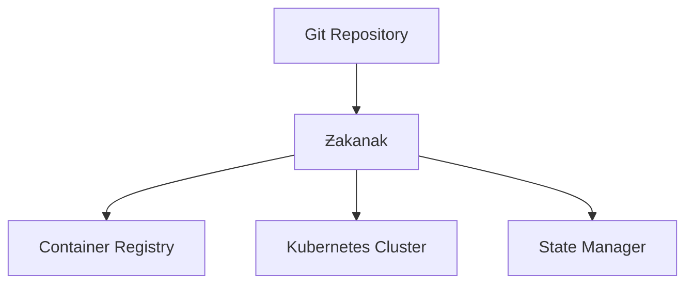

# Zakenak
```ascii
 ______     _                      _    
|___  /    | |                    | |   
   / / __ _| |  _ _   ___     ___ | |  _
  / / / _` | |/ / _`||  _ \ / _` || |/ /
 / /_| (_| |  < by_Eberil| | (_| ||   < 
/_____\__,_|_|\_\__,||_| |_|\__,_||_|\_\

Should Harbour?	No.
```

[](https://goreportcard.com/report/github.com/i8megabit/zakenak)
[](LICENSE)
[][releases]

## [Zakenak](https://dic.academic.ru/dic.nsf/dic_synonims/390396/%D1%87%D0%B0%D0%BA%D0%B0%D0%BD%D0%B0%D0%BAчаканак "др.-чув. чӑканӑк — бухта, залив")

Zakenak — профессиональный инструмент GitOps для эффективной оркестрации Kubernetes-кластеров с поддержкой GPU через Helm.


### Ключевые преимущества
- 🚀 **Автономность**: Единый бинарный файл без внешних зависимостей
- 🔄 **GitOps**: Встроенная поддержка GitOps и автоматической конвергенции
- 🐳 **Интеграция**: Нативная работа с container registry
- 🖥️ **Совместимость**: Полная поддержка WSL2 и NVIDIA GPU
- 📝 **Простота**: Интуитивная но мощная система шаблонизации

## Начало работы

### Системные требования
- Go 1.21+
- WSL2 (Ubuntu 22.04 LTS)
- NVIDIA GPU (RTX 4080 или выше)
- NVIDIA Driver 535.104.05+
- CUDA Toolkit 12.8+
- Docker Desktop с WSL2 интеграцией
- NVIDIA Container Toolkit
- Kind v0.20.0+
- Helm 3.0+

## Развертывание кластера

### Автоматическая установка
```bash
# Запуск полной установки
./tools/k8s-kind-setup/deploy-all/src/deploy-all.sh

# Процесс включает:
# 1. Проверку GPU в WSL2:
#    - Наличие и версию драйвера NVIDIA
#    - Установку CUDA Toolkit
#    - Настройку NVIDIA Container Toolkit
# 2. Проверку GPU в кластере:
#    - Наличие узлов с GPU
#    - Работу NVIDIA device plugin
#    - Тестирование тензорных операций
# 3. Установку базовых компонентов:
#    - Ingress NGINX Controller
#    - Cert Manager и Local CA
#    - CoreDNS
# 4. Развертывание приложений:
#    - Ollama с GPU поддержкой
#    - Open WebUI
#    - Kubernetes Dashboard
```

### Проверка GPU
```bash
# Проверка GPU в WSL2
nvidia-smi
nvcc --version
docker run --rm --gpus all nvidia/cuda:12.8.0-base-ubuntu22.04 nvidia-smi

# Проверка GPU в кластере
kubectl get nodes -l nvidia.com/gpu=true
kubectl get pods -n kube-system -l k8s-app=nvidia-device-plugin-daemonset
kubectl describe node -l nvidia.com/gpu=true | grep nvidia.com/gpu

# Проверка тензорных операций
kubectl run tensor-test --rm -it --image=nvcr.io/nvidia/pytorch:23.12-py3 \
  --command -- python3 -c "import torch; print(torch.cuda.is_available())"
```

### Переменные окружения
| Переменная | Описание | По умолчанию |
|------------|-----------|--------------|
| `NVIDIA_DRIVER_MIN_VERSION` | Минимальная версия драйвера | `535.104.05` |
| `CUDA_MIN_VERSION` | Минимальная версия CUDA | `12.8` |
| `NVIDIA_VISIBLE_DEVICES` | GPU устройства | `all` |
| `NVIDIA_DRIVER_CAPABILITIES` | Возможности драйвера | `compute,utility` |
| `KUBECONFIG` | Путь к kubeconfig | `~/.kube/config` |
| `REGISTRY_USER` | Пользователь registry | - |
| `REGISTRY_PASS` | Пароль registry | - |

### Установка
```bash
# Клонирование репозитория
git clone https://github.com/i8megabit/zakenak
cd zakenak

# Сборка
make build

# Установка
sudo make install
```

### Базовая конфигурация
```yaml
project: myapp
environment: prod

deploy:
  namespace: prod
  charts:
    - ./helm/myapp
```

## Развертывание кластера

### Автоматическая установка
```bash
# Запуск полной установки
./tools/k8s-kind-setup/deploy-all/src/deploy-all.sh

# Процесс включает:
# 1. Проверку конфигурации кластера и авторизации
# 2. Валидацию GPU ресурсов и CUDA
# 3. Установку базовых компонентов (ingress-nginx, cert-manager, etc.)
# 4. Настройку DNS и TLS
# 5. Развертывание приложений
```

### Ручная установка компонентов
```bash
# Установка отдельных компонентов
./tools/k8s-kind-setup/charts/src/charts.sh install cert-manager
./tools/k8s-kind-setup/charts/src/charts.sh install local-ca
./tools/k8s-kind-setup/charts/src/charts.sh install ollama
./tools/k8s-kind-setup/charts/src/charts.sh install open-webui
```

### Основные команды
```bash
# Конвергенция состояния
zakenak converge

# Сборка образов
zakenak build

# Деплой в кластер
zakenak deploy
```
## Использование Docker образа

### Получение образа
```bash
# Получение последней версии
docker pull ghcr.io/i8megabit/zakenak:latest

# Получение конкретной версии
docker pull ghcr.io/i8megabit/zakenak:1.0.0
```

### Базовое использование
```bash
# Запуск с конфигурацией из текущей директории
docker run -v $(pwd):/workspace \
	-v ~/.kube:/root/.kube \
	ghcr.io/i8megabit/zakenak:latest converge

# Запуск с указанием конфигурации
docker run -v $(pwd):/workspace \
	-v ~/.kube:/root/.kube \
	ghcr.io/i8megabit/zakenak:latest \
	--config /workspace/zakenak.yaml \
	converge
```

### Использование с GPU
```bash
docker run --gpus all \
	-v $(pwd):/workspace \
	-v ~/.kube:/root/.kube \
	-e NVIDIA_VISIBLE_DEVICES=all \
	-e NVIDIA_DRIVER_CAPABILITIES=compute,utility \
	ghcr.io/i8megabit/zakenak:latest converge
```

### Монтирование томов
#### Обязательные тома
- `/workspace`: Рабочая директория с конфигурацией
- `~/.kube`: Конфигурация Kubernetes

#### Опциональные тома
- `/root/.cache`: Кэш для ускорения работы
- `/var/run/docker.sock`: Для работы с локальным Docker

### Безопасность Docker контейнера
```bash
# Пример безопасного запуска
docker run --read-only \
	--security-opt=no-new-privileges \
	-v $(pwd):/workspace:ro \
	-v ~/.kube:/root/.kube:ro \
	--network=host \
	ghcr.io/i8megabit/zakenak:1.0.0 converge
```

## Базовая конфигурация
```bash
project: myapp
environment: prod

registry:
    url: registry.local
    username: ${REGISTRY_USER}
    password: ${REGISTRY_PASS}

deploy:
    namespace: prod
    charts:
        - ./helm-charts/cert-manager
        - ./helm-charts/local-ca
        - ./helm-charts/ollama
        - ./helm-charts/open-webui
    values:
        - values.yaml
        - values-prod.yaml

build:
    context: .
    dockerfile: Dockerfile
    args:
        VERSION: v1.0.0
    gpu:
        enabled: true
        runtime: nvidia
        memory: "8Gi"
        devices: "all"
```

## Основные команды
```bash
# Конвергенция состояния
zakenak converge

# Сборка образов
zakenak build

# Деплой в кластер
zakenak deploy
```

## Переменные окружения
| Переменная | Описание | По умолчанию |
|------------|-----------|--------------|
| `KUBECONFIG` | Путь к kubeconfig | `~/.kube/config` |
| `ZAKENAK_DEBUG` | Включение отладки | `false` |
| `NVIDIA_VISIBLE_DEVICES` | GPU устройства | `all` |
| `NVIDIA_DRIVER_CAPABILITIES` | Возможности драйвера | `compute,utility` |
| `REGISTRY_USER` | Пользователь registry | - |
| `REGISTRY_PASS` | Пароль registry | - |

## Архитектура


## Компоненты
- 💫 **State Manager**: Управление состоянием кластера
- 🔧 **Build System**: Сборка с поддержкой GPU
- 🎯 **Deploy Engine**: Умный деплой в Kubernetes
- 🔄 **GitOps Controller**: Синхронизация с Git
- 🎮 **CLI Interface**: Удобное управление

## Безопасность
- 🔒 Защита интеллектуальной собственности
- 🛡️ Встроенная поддержка RBAC
- 🔐 Безопасное хранение креденшелов
- ✅ Валидация конфигураций

## Лицензирование
Zakenak распространяется под MIT лицензией.

## Поддержка
- 📚 [Документация](docs/)
- 💡 [Примеры](examples/)
- 🔧 [Устранение неполадок](docs/troubleshooting.md)
- 📖 [API Reference](docs/api.md)

## Авторы
- [@eberil](https://github.com/eberil) - Основной разработчик

## Благодарности
- Команде Werf за вдохновение
- Сообществу Kubernetes
- Всем контрибьюторам

[releases]: https://github.com/i8megabit/zakenak/releases

```plain text
Copyright (c) 2025 Mikhail Eberil

This file is part of Zakenak project and is released under the terms of the MIT License. 
See LICENSE file in the project root for full license information.

THE SOFTWARE IS PROVIDED "AS IS", WITHOUT WARRANTY OF ANY KIND, EXPRESS OR IMPLIED, 
INCLUDING BUT NOT LIMITED TO THE WARRANTIES OF MERCHANTABILITY, FITNESS FOR A PARTICULAR 
PURPOSE AND NONINFRINGEMENT.
```