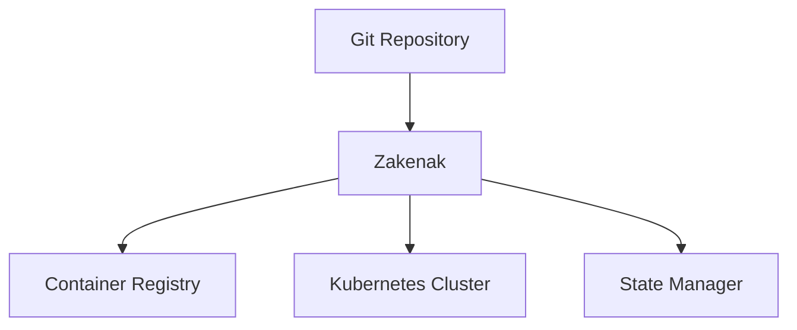

# Zakenak
```ascii
 ______     _                      _    
|___  /    | |                    | |   
   / / __ _| |  _ _   ___     ___ | |  _
  / / / _` | |/ / _`||  _ \ / _` || |/ /
 / /_| (_| |  < by_Eberil| | (_| ||   < 
/_____\__,_|_|\_\__,||_| |_|\__,_||_|\_\

Should Harbour?	No.
```

[](https://goreportcard.com/report/github.com/i8megabit/zakenak)
[](LICENSE)
[][releases]

## [Zakenak](https://dic.academic.ru/dic.nsf/dic_synonims/390396/%D1%87%D0%B0%D0%BA%D0%B0%D0%BD%D0%B0%D0%BAчаканак "др.-чув. чӑканӑк — бухта, залив")

Zakenak — профессиональный инструмент GitOps для эффективной оркестрации Kubernetes-кластеров с поддержкой GPU через Helm.


### Ключевые преимущества
- 🚀 **Автономность**: Единый бинарный файл без внешних зависимостей
- 🔄 **GitOps**: Встроенная поддержка GitOps и автоматической конвергенции
- 🐳 **Интеграция**: Нативная работа с container registry
- 🖥️ **Совместимость**: Полная поддержка WSL2 и NVIDIA GPU
- 📝 **Простота**: Интуитивная но мощная система шаблонизации

## Начало работы

### Системные требования
- Go 1.21+
- WSL2 (Ubuntu 22.04 LTS)
- NVIDIA GPU (RTX 4080 или выше)
- NVIDIA Driver 535.104.05+
- CUDA Toolkit 12.6.1+
- Docker Desktop с WSL2 интеграцией
- NVIDIA Container Toolkit
- Kind v0.20.0+
- Helm 3.0+

## Окружения

Zakenak поддерживает два основных окружения:

### Dev окружение
- Все эндпоинты и проверки к домену `*.dev.local`
- Все чарты деплоятся в namespace `dev`
- Используется локальный центр сертификации (Local CA)

### Prod окружение
- Все эндпоинты и проверки к домену `*.eberil.ru`
- Все чарты деплоятся в namespace `prod`
- Используется Let's Encrypt для получения сертификатов

Подробнее см. [Руководство по использованию окружений](docs/ENVIRONMENTS.md).

## Развертывание кластера

### Автоматическая установка
```bash
# Запуск полной установки
./tools/k8s-kind-setup/deploy-all/src/deploy-all.sh

# Процесс включает:
# 1. Проверку GPU в WSL2:
#    - Наличие и версию драйвера NVIDIA
#    - Установку CUDA Toolkit
#    - Настройку NVIDIA Container Toolkit
# 2. Проверку GPU в кластере:
#    - Наличие узлов с GPU
#    - Работу NVIDIA device plugin
#    - Тестирование тензорных операций
# 3. Установку базовых компонентов:
#    - Ingress NGINX Controller
#    - Cert Manager и Local CA
#    - CoreDNS
# 4. Развертывание приложений:
#    - Ollama с GPU поддержкой
#    - Open WebUI
#    - Kubernetes Dashboard
```

### Настройка WSL2 для KIND с GPU
```bash
# Настройка cgroup для WSL2 (выполнить на Windows в PowerShell)
# Создайте или отредактируйте файл %UserProfile%\.wslconfig
notepad "$env:USERPROFILE\.wslconfig"

# Добавьте следующие настройки в .wslconfig:
# [boot]
# systemd=true
# [wsl2]
# memory=24GB
# processors=8
# swap=8GB
# localhostForwarding=true
# kernelCommandLine = cgroup_no_v1=all cgroup_enable=memory swapaccount=1
# nestedVirtualization=true
# guiApplications=true

# Настройка Docker внутри WSL2 для работы с cgroup v2
# Эти настройки применяются к Docker daemon внутри WSL2, а не к Docker Desktop
sudo mkdir -p /etc/docker
sudo tee /etc/docker/daemon.json > /dev/null << EOF
{
  "exec-opts": ["native.cgroupdriver=systemd"],
  "log-driver": "json-file",
  "log-opts": {
    "max-size": "100m"
  }
}
EOF

# Перезапуск Docker внутри WSL2
sudo systemctl restart docker || sudo service docker restart

# Перезапуск WSL (выполнить в PowerShell на Windows)
# wsl --shutdown
```

Эти настройки необходимы для корректной работы KIND с GPU в WSL2, особенно при использовании cgroup v2. Они решают проблему с ошибкой "could not find a log line that matches 'Reached target .*Multi-User System.*|detected cgroup v1'" при создании кластера.

### Проверка GPU
```bash
# Проверка GPU в WSL2
nvidia-smi
docker run --rm --gpus all nvidia/cuda:12.6.1-base-ubuntu22.04 nvidia-smi

# Проверка GPU в кластере
kubectl get nodes -l nvidia.com/gpu=true
kubectl get pods -n kube-system -l k8s-app=nvidia-device-plugin-daemonset
kubectl describe node -l nvidia.com/gpu=true | grep nvidia.com/gpu

# Проверка тензорных операций
kubectl run tensor-test --rm -it --image=nvcr.io/nvidia/pytorch:23.12-py3 \
  --command -- python3 -c "import torch; print(torch.cuda.is_available())"
```

### Переменные окружения
| Переменная | Описание | По умолчанию |
|------------|-----------|--------------|
| `NVIDIA_DRIVER_MIN_VERSION` | Минимальная версия драйвера | `535.104.05` |
| `CUDA_MIN_VERSION` | Минимальная версия CUDA | `12.6.1` |
| `NVIDIA_VISIBLE_DEVICES` | GPU устройства | `all` |
| `NVIDIA_DRIVER_CAPABILITIES` | Возможности драйвера | `compute,utility` |
| `KUBECONFIG` | Путь к kubeconfig | `~/.kube/config` |
| `REGISTRY_USER` | Пользователь registry | - |
| `REGISTRY_PASS` | Пароль registry | - |

### Установка
```bash
# Клонирование репозитория
git clone https://github.com/i8megabit/zakenak
cd zakenak

# Сборка
make build

# Установка
sudo make install
```

### Базовая конфигурация
```yaml
project: myapp
environment: prod

deploy:
  namespace: prod
  charts:
    - ./helm/myapp
```

## Развертывание кластера

### Автоматическая установка
```bash
# Запуск полной установки
./tools/k8s-kind-setup/deploy-all/src/deploy-all.sh

# Процесс включает:
# 1. Проверку конфигурации кластера и авторизации
# 2. Валидацию GPU ресурсов и CUDA
# 3. Установку базовых компонентов (ingress-nginx, cert-manager, etc.)
# 4. Настройку DNS и TLS
# 5. Развертывание приложений
```

### Ручная установка компонентов
```bash
# Установка отдельных компонентов
./tools/k8s-kind-setup/charts/src/charts.sh install cert-manager
./tools/k8s-kind-setup/charts/src/charts.sh install local-ca
./tools/k8s-kind-setup/charts/src/charts.sh install ollama
./tools/k8s-kind-setup/charts/src/charts.sh install open-webui
```

### Основные команды
```bash
# Конвергенция состояния
zakenak converge

# Сборка образов
zakenak build

# Деплой в кластер
zakenak deploy
```
## Использование Docker образа

### Получение образа
```bash
# Получение последней версии
docker pull ghcr.io/i8megabit/zakenak:latest

# Получение конкретной версии
docker pull ghcr.io/i8megabit/zakenak:1.0.0
```

### Базовое использование
```bash
# Запуск с конфигурацией из текущей директории
docker run -v $(pwd):/workspace \
	-v ~/.kube:/root/.kube \
	ghcr.io/i8megabit/zakenak:latest converge

# Запуск с указанием конфигурации
docker run -v $(pwd):/workspace \
	-v ~/.kube:/root/.kube \
	ghcr.io/i8megabit/zakenak:latest \
	--config /workspace/zakenak.yaml \
	converge
```

## Решение проблемы с сертификатами

При доступе к сервисам через HTTPS (например, `https://dashboard.prod.local`) браузер может показывать ошибку безопасности:

```
Ваше подключение не является закрытым
Злоумышленники могут пытаться украсть ваши данные (например, пароли, сообщения или номера кредитных карт) с dashboard.prod.local.
net::ERR_CERT_AUTHORITY_INVALID
```

Это происходит потому, что кластер использует самоподписанные сертификаты, которые не доверены браузером по умолчанию.

### Экспорт и установка корневого CA сертификата

Для решения этой проблемы необходимо экспортировать корневой CA сертификат и добавить его в доверенные сертификаты браузера:

```bash
# Экспорт корневого CA сертификата
./tools/k8s-kind-setup/setup-cert-manager/src/export-root-ca.sh
```

Скрипт экспортирует сертификат в `~/zakenak-certs/zakenak-root-ca.crt` и выводит инструкции по его установке в различных браузерах и операционных системах.

После установки сертификата в доверенные, браузер будет доверять всем сертификатам, выданным этим CA, и вы сможете безопасно открывать:
- https://dashboard.prod.local
- https://ollama.prod.local
- https://webui.prod.local

### Настройка Let's Encrypt с Cloudflare DNS

Для доменов, доступных из интернета (например, webui.eberil.ru), можно использовать Let's Encrypt для получения доверенных сертификатов. Для упрощения настройки предоставляется специальный скрипт:

```bash
# Установка переменной окружения с API токеном Cloudflare
export CLOUDFLARE_API_TOKEN="ваш-api-токен-cloudflare"

# Запуск скрипта настройки Let's Encrypt с Cloudflare DNS
./tools/k8s-kind-setup/setup-cert-manager/src/setup-letsencrypt.sh
```

Скрипт автоматически выполнит следующие действия:
1. Проверит наличие и установит cert-manager, если необходимо
2. Создаст секрет с API токеном Cloudflare
3. Настроит ClusterIssuer для Let's Encrypt с использованием DNS01 challenge через Cloudflare
4. Создаст сертификат для webui.eberil.ru

Для этого необходимо:
1. Создать API токен в панели управления Cloudflare с правами на редактирование DNS записей для вашей зоны
2. Указать этот токен в переменной окружения CLOUDFLARE_API_TOKEN
3. Убедиться, что в values.prod.yaml для cert-manager указаны правильные настройки:
   - Правильный email для Let's Encrypt и Cloudflare
   - Правильная DNS зона (например, eberil.ru)

После успешной настройки, сертификаты будут автоматически выпущены и обновлены Let's Encrypt, и браузеры будут доверять этим сертификатам без дополнительных действий.

Для ручной настройки можно использовать следующие команды:

```bash
# Установка cert-manager с поддержкой Let's Encrypt
./tools/k8s-kind-setup/charts/src/charts.sh install cert-manager --values helm-charts/cert-manager/values.prod.yaml
```

### Использование с GPU
```bash
docker run --gpus all \
	-v $(pwd):/workspace \
	-v ~/.kube:/root/.kube \
	-e NVIDIA_VISIBLE_DEVICES=all \
	-e NVIDIA_DRIVER_CAPABILITIES=compute,utility \
	ghcr.io/i8megabit/zakenak:latest converge
```

## Оптимизация для модели deepseek-r1:14b-qwen-distill-q4_K_M

Для оптимальной работы с моделью deepseek-r1:14b-qwen-distill-q4_K_M в Ollama через Docker Compose:

```bash
# Установка модели с оптимизированными настройками
./setup-deepseek-model.sh
```

### Оптимизированные настройки
Для модели deepseek-r1:14b-qwen-distill-q4_K_M настроены следующие оптимизированные параметры:

```yaml
environment:
  - OLLAMA_HOST=0.0.0.0
  - OLLAMA_COMPUTE_TYPE=gpu
  - OLLAMA_GPU_LAYERS=99
  - OLLAMA_F16=true
  - OLLAMA_QUANTIZATION=q4_K_M
  - OLLAMA_CUDA_MEMORY_FRACTION=0.95
  - OLLAMA_CUDA_FORCE_ALLOCATION=true
  - OLLAMA_MODEL=deepseek-r1:14b-qwen-distill-q4_K_M
  - OLLAMA_CONTEXT_SIZE=8192
```

### Рекомендуемый процесс установки
1. Скачайте модель через Windows-приложение Ollama
2. Скопируйте файлы модели в примонтированный к Docker-контейнеру каталог `/mnt/o`
3. Установите права доступа к файлам модели на `root:root`
4. Запустите Ollama через Docker Compose с оптимизированными настройками

Подробная документация: [README-DEEPSEEK-MODEL.md](README-DEEPSEEK-MODEL.md)

### Монтирование томов
#### Обязательные тома
- `/workspace`: Рабочая директория с конфигурацией
- `~/.kube`: Конфигурация Kubernetes

#### Опциональные тома
- `/root/.cache`: Кэш для ускорения работы
- `/var/run/docker.sock`: Для работы с локальным Docker

### Безопасность Docker контейнера
```bash
# Пример безопасного запуска
docker run --read-only \
	--security-opt=no-new-privileges \
	-v $(pwd):/workspace:ro \
	-v ~/.kube:/root/.kube:ro \
	--network=host \
	ghcr.io/i8megabit/zakenak:1.0.0 converge
```

## Базовая конфигурация
```bash
project: myapp
environment: prod

registry:
    url: registry.local
    username: ${REGISTRY_USER}
    password: ${REGISTRY_PASS}

deploy:
    namespace: prod
    charts:
        - ./helm-charts/cert-manager
        - ./helm-charts/local-ca
        - ./helm-charts/ollama
        - ./helm-charts/open-webui
    values:
        - values.yaml
        - values-prod.yaml

build:
    context: .
    dockerfile: Dockerfile
    args:
        VERSION: v1.0.0
    gpu:
        enabled: true
        runtime: nvidia
        memory: "8Gi"
        devices: "all"
```

## Основные команды
```bash
# Конвергенция состояния
zakenak converge

# Сборка образов
zakenak build

# Деплой в кластер
zakenak deploy
```

## Переменные окружения
| Переменная | Описание | По умолчанию |
|------------|-----------|--------------|
| `KUBECONFIG` | Путь к kubeconfig | `~/.kube/config` |
| `ZAKENAK_DEBUG` | Включение отладки | `false` |
| `NVIDIA_VISIBLE_DEVICES` | GPU устройства | `all` |
| `NVIDIA_DRIVER_CAPABILITIES` | Возможности драйвера | `compute,utility` |
| `REGISTRY_USER` | Пользователь registry | - |
| `REGISTRY_PASS` | Пароль registry | - |

## Архитектура

```mermaid
graph TD
    A[Git Repository] --> B[Zakenak]
    B --> C[Container Registry]
    B --> D[Kubernetes Cluster]
    B --> E[State Manager]
```

## Компоненты
- 💫 **State Manager**: Управление состоянием кластера
- 🔧 **Build System**: Сборка с поддержкой GPU
- 🎯 **Deploy Engine**: Умный деплой в Kubernetes
- 🔄 **GitOps Controller**: Синхронизация с Git
- 🎮 **CLI Interface**: Удобное управление

## Безопасность
- 🔒 Защита интеллектуальной собственности
- 🛡️ Встроенная поддержка RBAC
- 🔐 Безопасное хранение креденшелов
- ✅ Валидация конфигураций

## Лицензирование
Zakenak распространяется под MIT лицензией.

## Поддержка
- 📚 [Документация](docs/)
  - [Руководство по развертыванию](docs/DEPLOYMENT.md)
  - [GitOps подход](docs/GITOPS.md)
  - [API Reference](docs/api.md)
  - [Устранение неполадок](docs/troubleshooting.md)
  - [GPU в WSL2](docs/GPU-WSL.md)
  - [Использование Docker](docs/DOCKER-USAGE.md)
  - [Настройка KUBECONFIG](docs/KUBECONFIG.md)
  - [Мониторинг](docs/MONITORING.md)
  - [Настройка сети](docs/NETWORK-CONFIGURATION.md)
  - [Доступ к Open WebUI из локальной сети](docs/ACCESSING-OPEN-WEBUI.md)
  - [Миграция и настройка WSL и Docker](docs/WSL-DOCKER-MIGRATION.md)
  - [Окружения](docs/ENVIRONMENTS.md)
- 💡 [Примеры](examples/)

## Авторы
- [@eberil](https://github.com/eberil) - Основной разработчик

## Благодарности
- Команде Werf за вдохновение
- Сообществу Kubernetes
- Всем контрибьюторам

[releases]: https://github.com/i8megabit/zakenak/releases

```plain text
Copyright (c) 2025 Mikhail Eberil

This file is part of Zakenak project and is released under the terms of the MIT License. 
See LICENSE file in the project root for full license information.

THE SOFTWARE IS PROVIDED "AS IS", WITHOUT WARRANTY OF ANY KIND, EXPRESS OR IMPLIED, 
INCLUDING BUT NOT LIMITED TO THE WARRANTIES OF MERCHANTABILITY, FITNESS FOR A PARTICULAR 
PURPOSE AND NONINFRINGEMENT.
```