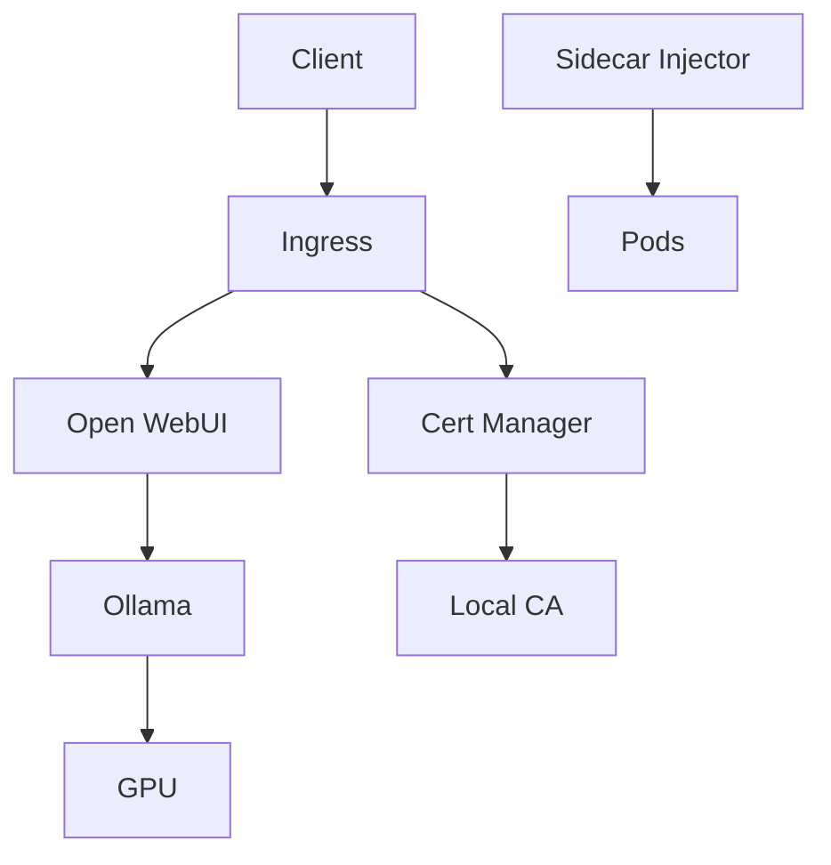

# Архитектура Ƶakenak™®
```ascii
 ______     _                      _    
|___  /    | |                    | |   
   / / __ _| |  _ _   ___     ___ | |  _
  / / / _` | |/ / _`||  _ \ / _` || |/ /
 / /_| (_| |  < by_Eberil| | (_| ||   < 
/_____\__,_|_|\_\__,||_| |_|\__,_||_|\_\

Should Harbour?	No.
```
## Общий обзор

Ƶakenak™® построен на основе микросервисной архитектуры с использованием Kubernetes в качестве оркестратора. Система разделена на несколько ключевых компонентов, каждый из которых выполняет специфическую роль.

## Компоненты системы

### 1. Core Services

#### Cert Manager
- Управление жизненным циклом TLS сертификатов
- Автоматическое обновление и ротация
- Интеграция с внешними CA

#### Local CA
- Генерация корневого сертификата
- Выпуск сертификатов для внутренних сервисов
- Управление цепочками доверия

#### Sidecar Injector
- Автоматическая инжекция TLS прокси
- Терминация TLS соединений
- Управление сертификатами на уровне пода

### 2. AI Services

#### Ollama
- Запуск LLM моделей
- Управление GPU ресурсами
- Оптимизация производительности

#### Open WebUI
- Веб-интерфейс для взаимодействия с LLM
- Управление контекстом и историей
- Кастомизация промптов

### 3. Infrastructure Services

#### NVIDIA Integration
- Device Plugin для GPU
- Runtime Class для контейнеров
- Мониторинг ресурсов

#### Networking
- Ingress Controller
- CoreDNS с кастомной конфигурацией
- Network Policies

## Взаимодействие компонентов



## Безопасность

### TLS Flow
1. Local CA генерирует корневой сертификат
2. Cert Manager запрашивает сертификаты для сервисов
3. Sidecar Injector внедряет TLS прокси
4. Ingress терминирует внешний TLS

### GPU Security
1. Node Labels для GPU ресурсов
2. Resource Quotas
3. Pod Security Policies
4. NVIDIA Runtime изоляция

## Масштабирование

### Вертикальное
- Динамическое управление ресурсами
- GPU Memory Optimization
- Batch Size адаптация

### Горизонтальное
- Multi-GPU поддержка
- Pod распределение
- Load Balancing

## Мониторинг

### Метрики
- GPU Utilization
- Memory Usage
- Temperature
- Power Consumption

### Логирование
- Централизованный сбор логов
- Структурированный формат
- Retention Policies

## Развертывание

### Процесс
1. Инициализация кластера
2. Установка Core Services
3. Настройка GPU support
4. Развертывание AI сервисов

### Конфигурация
- Helm Values
- Environment Variables
- ConfigMaps
- Secrets

## Требования к окружению

### Hardware
- NVIDIA GPU (Compute Capability 7.0+)
- 16GB RAM минимум
- SSD storage

### Software
- WSL2 с Ubuntu 22.04
- CUDA 12.8
- Docker с NVIDIA Runtime
- Kubernetes 1.25+

```plain text
Copyright (c)  2025 Mikhail Eberil

This file is part of Zakenak project and is released under the terms of the MIT License. See LICENSE file in the project root for full license information.

THE SOFTWARE IS PROVIDED "AS IS", WITHOUT WARRANTY OF ANY KIND, EXPRESS OR IMPLIED, INCLUDING BUT NOT LIMITED TO THE WARRANTIES OF MERCHANTABILITY, FITNESS FOR A PARTICULAR PURPOSE AND NONINFRINGEMENT.

The name "Zakenak" and associated branding are trademarks of @eberil and may not be used without express written permission.
```