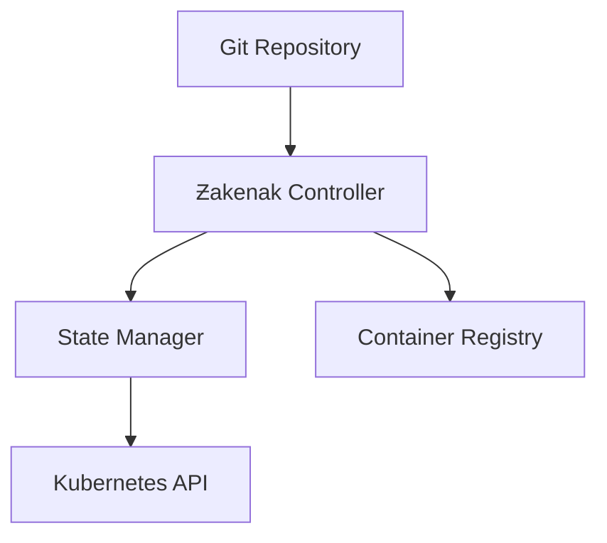

# Copyright (c) 2023-2025 Mikhail Eberil (@eberil)
# 
# This file is part of Ƶakenak™® project.
# https://github.com/i8megabit/zakenak
#
# This program is free software and is released under the terms of the MIT License.
# See LICENSE.md file in the project root for full license information.
#
# THE SOFTWARE IS PROVIDED "AS IS", WITHOUT WARRANTY OF ANY KIND, EXPRESS OR
# IMPLIED, INCLUDING BUT NOT LIMITED TO THE WARRANTIES OF MERCHANTABILITY,
# FITNESS FOR A PARTICULAR PURPOSE AND NONINFRINGEMENT.
#
# TRADEMARK NOTICE:
# Ƶakenak™® and the Ƶakenak logo are registered trademarks of Mikhail Eberil.
# All rights reserved. The Ƶakenak trademark and brand may not be used in any way 
# without express written permission from the trademark owner.


# Ƶakenak™® GitOps Repository

```ascii
 ______     _                      _    
|___  /    | |                    | |   
   / / __ _| |  _ _   ___     ___ | |  _
  / / / _` | |/ / _`||  _ \ / _` || |/ /
 / /_| (_| |  < by_Eberil| | (_| ||   < 
/_____\__,_|_|\_\__,||_| |_|\__,_||_|\_\

Should Harbour?	No.
```

## Версия
1.3.2h

## Описание
Платформа для оркестрации GPU-ускоренных сервисов в среде WSL2, реализующая принципы GitOps.

## Принципы GitOps

### Декларативность
- Вся инфраструктура описана в Git
- Автоматическая синхронизация состояний
- Версионирование конфигураций
- История изменений

### Единый источник истины
- Git как единственный источник
- Автоматическая валидация
- Предсказуемые развертывания
- Аудит изменений

## Архитектура

### Компоненты


### State Manager
- Отслеживание состояния
- Reconciliation loops
- Обработка конфликтов
- Rollback механизмы

## Компоненты системы

### Core Services
- cert-manager: Управление TLS сертификатами
  - Автоматическое обновление
  - Интеграция с локальным CA
  - Поддержка wildcard сертификатов

- local-ca: Локальный центр сертификации
  - Генерация корневых сертификатов
  - Управление цепочками доверия
  - Интеграция с cert-manager

- sidecar-injector: Инжекция TLS прокси
  - Автоматическая инжекция сайдкаров
  - Терминация TLS
  - Мониторинг состояния

### AI Services
- ollama: LLM сервер с GPU-акселерацией
  - Оптимизация GPU использования
  - Управление моделями
  - Поддержка deepseek-r1:14b
  - Конфигурация CUDA параметров

- open-webui: Веб-интерфейс для Ollama
  - Интеграция с LLM сервером
  - Управление контекстом
  - Оптимизация памяти
  - Кастомные промпты

### Infrastructure
- NVIDIA device plugin для WSL2
  - Управление GPU ресурсами
  - Мониторинг устройств
  - Оптимизация производительности

- CoreDNS с поддержкой .prod.local зоны
  - Резолвинг внутренних сервисов
  - Интеграция с Ingress
  - Кастомные записи DNS

## GPU-специфика

### Управление ресурсами
- Декларативное описание GPU
- Автоматическое масштабирование
- Мониторинг использования
- Оптимизация ресурсов

### Безопасность
- RBAC для GPU-ресурсов
- Изоляция воркеров
- Аудит использования
- Контроль доступа

## Практики работы

### Workflow
1. Создание feature branch
2. Внесение изменений
3. Тестирование
4. Code review
5. Merge в main
6. Автоматический deploy

### Структура репозитория
```bash
.
├── helm-charts/          # Helm чарты компонентов
├── manifests/           # K8s манифесты
├── scripts/            # Скрипты автоматизации
└── tools/              # Инструменты
```

## Автоматизация

### CI/CD Pipeline
- Автоматическая сборка
- Тестирование
- Сканирование безопасности
- Деплой в кластер

### Мониторинг
- Prometheus метрики
- Grafana дашборды
- Алертинг
- Логирование

## Системные требования

### Hardware
- NVIDIA GPU с поддержкой CUDA (Compute Capability 7.0+)
- Минимум 16GB RAM
- SSD хранилище
- PCIe x16 слот

### Software
- Windows 11 с WSL2 (Ubuntu 22.04 LTS)
- NVIDIA Driver 535.104.05+
- CUDA Toolkit 12.8
- Docker с NVIDIA Container Runtime
- Kubernetes 1.25+

## Лучшие практики

### Версионирование
- Семантическое версионирование
- Тэгирование релизов
- Changelog
- Release notes

### Безопасность
- Подпись коммитов
- Защита веток
- Сканирование секретов
- Аудит доступа

## Интеграции

### Поддерживаемые платформы
- GitHub
- GitLab
- Bitbucket
- Azure DevOps

### Container Registry
- Docker Hub
- GitHub Container Registry
- Private registries
- Harbor

## Troubleshooting

### Общие проблемы
- Конфликты состояний
- Проблемы синхронизации
- Ошибки деплоя
- Сетевые issues

### Решения
- Логи контроллера
- Состояние ресурсов
- Откат изменений
- Ручная синхронизация

## Лицензирование
Ƶakenak™® является зарегистрированной торговой маркой.
См. LICENSE.md для деталей.