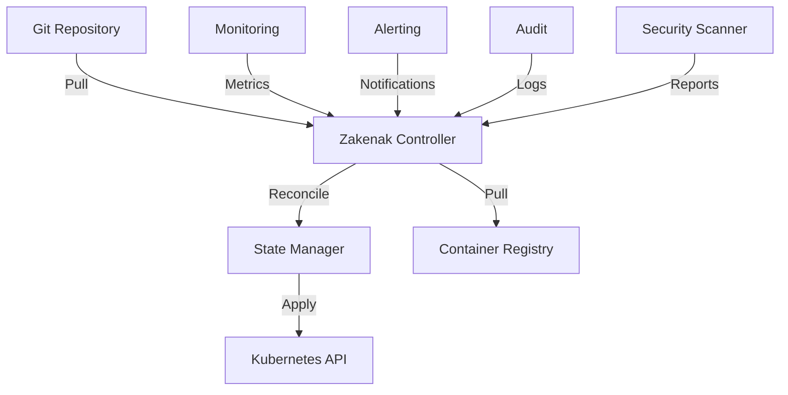

# Zakenak GitOps Repository

```ascii
 ______     _                      _    
|___  /    | |                    | |   
   / / __ _| |  _ _   ___     ___ | |  _
  / / / _` | |/ / _`||  _ \ / _` || |/ /
 / /_| (_| |  < by_Eberil| | (_| ||   < 
/_____\__,_|_|\_\__,||_| |_|\__,_||_|\_\

Should Harbour?	No.
```

## Навигация
- [Главная страница](../README.md)
- Документация
  - [Руководство по развертыванию](DEPLOYMENT.md)
  - [GitOps подход](GITOPS.md) (текущий документ)
  - [API Reference](api.md)
  - [Устранение неполадок](troubleshooting.md)
  - [GPU в WSL2](GPU-WSL.md)
  - [Использование Docker](DOCKER-USAGE.md)
  - [Настройка KUBECONFIG](KUBECONFIG.md)
  - [Мониторинг](MONITORING.md)
  - [Настройка сети](NETWORK-CONFIGURATION.md)
- [Примеры](../examples/README.md)

## Версия
1.3.4

## Описание
Платформа для оркестрации GPU-ускоренных сервисов в среде WSL2, реализующая принципы GitOps с фокусом на безопасность, масштабируемость и производительность.

## Принципы GitOps

### Декларативность
- Вся инфраструктура описана в Git как единый источник истины
- Автоматическая синхронизация желаемого и текущего состояния
- Версионирование всех конфигураций и манифестов
- Полная история изменений и возможность отката
- Автоматическая валидация изменений

### Единый источник истины
- Git как единственный авторитетный источник конфигурации
- Автоматическая валидация синтаксиса и семантики
- Предсказуемые и воспроизводимые развертывания
- Полный аудит всех изменений инфраструктуры
- Интеграция с системами контроля версий

## Архитектура

### Компоненты


### State Manager
- Непрерывное отслеживание состояния кластера
- Эффективные reconciliation loops с экспоненциальной задержкой
- Интеллектуальная обработка конфликтов состояний
- Надежные механизмы отката изменений
- Оптимизированная производительность синхронизации

## Компоненты системы

### Core Services
- cert-manager: Управление TLS сертификатами
  - Автоматическое обновление и ротация сертификатов
  - Интеграция с локальным CA и внешними провайдерами
  - Поддержка wildcard сертификатов и SAN
  - Мониторинг срока действия сертификатов
  - Автоматическое восстановление при сбоях

- local-ca: Локальный центр сертификации
  - Генерация и управление корневыми сертификатами
  - Безопасное хранение ключей в Kubernetes Secrets
  - Интеграция с внешними HSM (опционально)
  - Автоматическая ротация ключей по расписанию
  - Аудит всех операций с сертификатами

- sidecar-injector: Инжекция TLS прокси
  - Автоматическая инжекция сайдкаров по меткам
  - Терминация TLS с поддержкой SNI
  - Мониторинг состояния прокси
  - Автоматическое обновление конфигурации
  - Поддержка нескольких режимов работы

### AI Services
- ollama: LLM сервер с GPU-акселерацией
  - Оптимизированное управление GPU ресурсами
  - Динамическое управление моделями
  - Поддержка deepseek-r1:32b с 4-битной квантизацией (q4_0)
  - Автоматическая настройка CUDA параметров для максимальной производительности
  - Мониторинг производительности и метрик
  - Эффективное использование GPU памяти для больших моделей

- open-webui: Веб-интерфейс для Ollama
  - Интеграция с LLM сервером через API
  - Эффективное управление контекстом и памятью
  - Оптимизация использования ресурсов
  - Кастомизация промптов и настроек
  - Мониторинг активности пользователей

### Infrastructure
- NVIDIA device plugin для WSL2
  - Эффективное управление GPU ресурсами
  - Детальный мониторинг устройств
  - Оптимизация производительности
  - Автоматическое восстановление при сбоях
  - Поддержка Multi-Instance GPU (MIG)

- CoreDNS с поддержкой .prod.local зоны
  - Интеллектуальный резолвинг внутренних сервисов
  - Интеграция с Kubernetes Ingress
  - Поддержка кастомных DNS записей
  - Кэширование и оптимизация запросов
  - Мониторинг DNS метрик

## GPU-специфика

### Управление ресурсами
- Декларативное описание GPU требований
- Автоматическое масштабирование на основе метрик
- Детальный мониторинг использования GPU
- Оптимизация распределения ресурсов
- Приоритизация GPU задач

### Безопасность
- Строгие RBAC политики для GPU-ресурсов
- Изоляция GPU воркеров на уровне узлов
- Детальный аудит использования GPU
- Контроль доступа на основе ролей
- Мониторинг аномалий

## Практики работы

### Workflow
1. Создание feature branch из develop
2. Внесение изменений в конфигурацию
3. Автоматическое тестирование и валидация
4. Code review с проверкой безопасности
5. Merge в develop после одобрения
6. Автоматический deploy в кластер

### Структура репозитория
```bash
.
├── helm-charts/          # Helm чарты компонентов
│   ├── cert-manager/    # Управление сертификатами
│   ├── local-ca/        # Локальный CA
│   ├── ollama/          # LLM сервер
│   │   ├── templates/
│   │   ├── values.yaml
│   │   └── values-gpu.yaml
│   └── open-webui/      # Веб-интерфейс
├── manifests/           # K8s манифесты
│   ├── namespaces/
│   ├── rbac/
│   └── network-policies/
├── scripts/            # Скрипты автоматизации
│   ├── setup/
│   ├── backup/
│   └── monitoring/
└── tools/              # Вспомогательные инструменты
    ├── validation/
    ├── security/
    └── performance/
```

## Автоматизация

### CI/CD Pipeline
- Автоматическая сборка и тестирование
- Статический анализ конфигураций
- Сканирование уязвимостей
- Интеграционные тесты
- Автоматический деплой по тегам

### Мониторинг
- Prometheus метрики с GPU телеметрией
- Grafana дашборды для визуализации
- Alertmanager для оповещений
- Распределенное логирование
- Трейсинг запросов

## Системные требования

### Hardware
- NVIDIA GPU (Compute Capability 7.0+)
- Минимум 16GB RAM
- NVMe SSD хранилище
- PCIe x16 слот для GPU
- 10Gbps сеть (рекомендуется)

### Software
- Windows 11 Pro/Enterprise с WSL2 (Ubuntu 22.04 LTS)
- NVIDIA Driver 535.104.05+
- CUDA Toolkit 12.8
- Docker с NVIDIA Container Runtime
- Kubernetes 1.25+
- Helm 3.x

## Лучшие практики

### Версионирование
- Строгое семантическое версионирование (MAJOR.MINOR.PATCH)
- Тэгирование всех релизов в Git
- Подробный CHANGELOG для каждой версии
- Детальные Release Notes
- История изменений в Git

### Безопасность
- Обязательная подпись всех коммитов (GPG)
- Защита основных веток (branch protection)
- Автоматическое сканирование секретов
- Регулярный аудит доступа
- Мониторинг уязвимостей

## Интеграции

### Поддерживаемые платформы
- GitHub Enterprise
- GitLab Enterprise
- Bitbucket Server
- Azure DevOps Server
- Gitea (self-hosted)

### Container Registry
- GitHub Container Registry (ghcr.io)
- Docker Hub
- Private registries с авторизацией
- Harbor с поддержкой подписи
- Nexus Repository OSS/Pro

Для подробной информации об API интеграции см. [API Reference](api.md).

## Troubleshooting

### Общие проблемы
- Конфликты состояний при синхронизации
- Проблемы с GPU драйверами в WSL2
- Ошибки сертификатов и TLS
- Сетевые проблемы в кластере
- Проблемы производительности

### Решения
- Анализ логов контроллера и компонентов
- Проверка текущего состояния ресурсов
- Возможность быстрого отката изменений
- Автоматическая диагностика проблем
- Документированные процедуры восстановления

## Лицензирование

```plain text
Copyright (c) 2025 Mikhail Eberil

This file is part of Zakenak project and is released under the terms of the MIT License. 
See LICENSE file in the project root for full license information.

THE SOFTWARE IS PROVIDED "AS IS", WITHOUT WARRANTY OF ANY KIND, EXPRESS OR IMPLIED, 
INCLUDING BUT NOT LIMITED TO THE WARRANTIES OF MERCHANTABILITY, FITNESS FOR A PARTICULAR 
PURPOSE AND NONINFRINGEMENT.
```