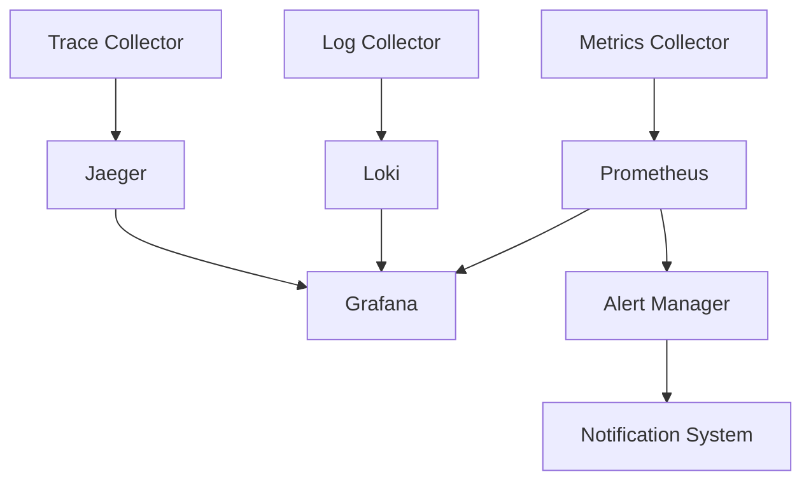

# Система мониторинга Ƶakenak™®

```ascii
 ______     _                      _    
|___  /    | |                    | |   
   / / __ _| |  _ _   ___     ___ | |  _
  / / / _` | |/ / _`||  _ \ / _` || |/ /
 / /_| (_| |  < by_Eberil| | (_| ||   < 
/_____\__,_|_|\_\__,||_| |_|\__,_||_|\_\

Should Harbour?	No.
```

## Архитектура мониторинга

### Компоненты системы


### Интеграции
| Компонент | Версия | Назначение |
|-----------|---------|------------|
| Prometheus | 2.45.0 | Сбор и хранение метрик |
| Grafana | 10.2.0 | Визуализация и дашборды |
| Loki | 2.9.0 | Агрегация логов |
| Jaeger | 1.50.0 | Распределенная трассировка |
| DCGM Exporter | 3.1.7 | Метрики NVIDIA GPU |

## GPU Мониторинг

### NVIDIA System Management Interface
```bash
# Базовая информация о GPU
nvidia-smi --query-gpu=timestamp,name,pci.bus_id,driver_version,pstate,temperature.gpu,utilization.gpu,utilization.memory,memory.total,memory.free,memory.used --format=csv

# Непрерывный мониторинг
nvidia-smi dmon -s pucvmet -i 0

# Профилирование процессов
nvidia-smi pmon -s um -o DT
```

### Prometheus Metrics

#### GPU Metrics
```yaml
# Core GPU Metrics
- nvidia_gpu_memory_used_bytes
- nvidia_gpu_memory_total_bytes
- nvidia_gpu_utilization_ratio
- nvidia_gpu_power_usage_watts
- nvidia_gpu_temperature_celsius
- nvidia_gpu_memory_bandwidth_bytes_per_second
- nvidia_gpu_pcie_bandwidth_bytes_per_second

# Process Metrics
- nvidia_gpu_process_memory_bytes
- nvidia_gpu_process_utilization_ratio
- nvidia_gpu_process_count

# Error Metrics
- nvidia_gpu_error_count
- nvidia_gpu_memory_error_count
- nvidia_gpu_pcie_error_count
```

#### Prometheus Rules
```yaml
groups:
- name: gpu.rules
  rules:
  - alert: GPUHighMemoryUsage
    expr: nvidia_gpu_memory_used_bytes / nvidia_gpu_memory_total_bytes > 0.90
    for: 5m
    labels:
      severity: warning
    annotations:
      description: "GPU {{$labels.gpu}} memory usage above 90% for 5 minutes"
      
  - alert: GPUHighTemperature
    expr: nvidia_gpu_temperature_celsius > 80
    for: 2m
    labels:
      severity: critical
    annotations:
      description: "GPU {{$labels.gpu}} temperature above 80°C"

  - alert: GPUErrorsDetected
    expr: increase(nvidia_gpu_error_count[5m]) > 0
    labels:
      severity: critical
    annotations:
      description: "GPU errors detected on {{$labels.gpu}}"
```

## Логирование

### Структура логов
```json
{
    "timestamp": "2025-01-20T12:00:00.000Z",
    "level": "INFO",
    "component": "ollama",
    "message": "Model loaded successfully",
    "metadata": {
        "model": "deepseek-r1:14b",
        "gpu_id": "0",
        "memory_allocated": "8GiB",
        "batch_size": 32,
        "compute_type": "float16"
    },
    "trace_id": "ab123c4d5e6f7890",
    "span_id": "1234567890abcdef"
}
```

### Log Levels
| Уровень | Описание | Примеры использования |
|---------|-----------|----------------------|
| ERROR | Критические ошибки | Сбой GPU, OOM, kernel panic |
| WARN | Предупреждения | Высокая температура GPU, memory leaks |
| INFO | Информационные сообщения | Загрузка модели, batch completion |
| DEBUG | Отладочная информация | Детали inference, memory allocation |
| TRACE | Детальная трассировка | CUDA calls, kernel execution |

### Loki Queries
```logql
# Поиск ошибок GPU
{component="ollama"} |= "error" | json | gpu_id != "" | count_over_time[1h]

# Мониторинг загрузки моделей
{component="ollama"} |= "Model loaded" | json | line_format "{{.model}} - {{.memory_allocated}}"

# Анализ производительности
{component="ollama"} | json | unwrap duration > 1s
```

## Трейсинг

### OpenTelemetry Configuration
```yaml
apiVersion: opentelemetry.io/v1alpha1
kind: Instrumentation
metadata:
  name: ollama-tracing
spec:
  exporter:
    endpoint: "jaeger-collector:4317"
  sampler:
    type: parentbased_traceidratio
    argument: "1.0"
  propagators:
    - tracecontext
    - baggage
```

### Основные спаны
1. Request Processing
   - HTTP Request Handling
   - Authentication & Authorization
   - Input Validation

2. Model Operations
   - Model Loading
   - Memory Allocation
   - CUDA Initialization
   - Batch Processing

3. Inference
   - Tokenization
   - Forward Pass
   - GPU Kernel Execution
   - Memory Management

4. Response Generation
   - Output Processing
   - Response Formatting
   - Error Handling

## Grafana Dashboards

### GPU Overview Dashboard
```grafana
Dashboard:
  - Row: GPU Utilization
    Panels:
      - GPU Usage %
      - Memory Usage %
      - Power Consumption
      - Temperature
      - Fan Speed
      - PCIe Bandwidth

  - Row: Memory Details
    Panels:
      - Memory Used/Total
      - Memory Bandwidth
      - Cache Hit Rate
      - Page Faults

  - Row: Process Information
    Panels:
      - Active Processes
      - Memory per Process
      - GPU Time per Process
      - Process Queue Length

  - Row: Errors & Alerts
    Panels:
      - Error Counter
      - Temperature Alerts
      - Memory Errors
      - PCIe Errors
```

### Application Performance Dashboard
```grafana
Dashboard:
  - Row: Request Metrics
    Panels:
      - Request Rate
      - Response Time
      - Error Rate
      - Active Connections

  - Row: Model Performance
    Panels:
      - Inference Time
      - Batch Size
      - Tokens/Second
      - Model Memory Usage

  - Row: Resource Usage
    Panels:
      - CPU Usage
      - RAM Usage
      - Network I/O
      - Disk I/O
```

## Алертинг

### Приоритеты инцидентов
| Приоритет | Время реакции | Примеры |
|-----------|---------------|---------|
| P1 | 15 минут | GPU failure, service down |
| P2 | 30 минут | High GPU temperature, memory leaks |
| P3 | 2 часа | Performance degradation |
| P4 | 8 часов | Non-critical warnings |

### Alert Manager Configuration
```yaml
global:
  resolve_timeout: 5m
  slack_api_url: 'https://hooks.slack.com/services/XXX/YYY/ZZZ'

route:
  group_by: ['alertname', 'cluster', 'service']
  group_wait: 30s
  group_interval: 5m
  repeat_interval: 4h
  receiver: 'slack-notifications'
  routes:
    - match:
        severity: critical
      receiver: 'pagerduty-critical'
      repeat_interval: 1h
    - match:
        severity: warning
      receiver: 'slack-warnings'

receivers:
  - name: 'slack-notifications'
    slack_configs:
      - channel: '#zakenak-alerts'
        send_resolved: true
        title: '{{ template "slack.title" . }}'
        text: '{{ template "slack.text" . }}'
        
  - name: 'pagerduty-critical'
    pagerduty_configs:
      - service_key: '<PAGERDUTY_KEY>'
        description: '{{ template "pagerduty.description" . }}'
```

## Автоматизация мониторинга

### Health Checks
```yaml
apiVersion: batch/v1
kind: CronJob
metadata:
  name: gpu-health-check
spec:
  schedule: "*/5 * * * *"
  jobTemplate:
    spec:
      template:
        spec:
          containers:
          - name: nvidia-smi
            image: nvidia/cuda:12.8.0-base-ubuntu22.04
            command:
            - /bin/sh
            - -c
            - |
              nvidia-smi --query-gpu=timestamp,name,pci.bus_id,driver_version,pstate,temperature.gpu,utilization.gpu,utilization.memory,memory.total,memory.free,memory.used --format=csv > /dev/stdout
          restartPolicy: OnFailure
```

### Метрики производительности
```bash
#!/bin/bash
# Performance Metrics Collection

# GPU Utilization
nvidia-smi --query-gpu=utilization.gpu --format=csv,noheader,nounits | \
  awk '{ sum += $1 } END { print "gpu_utilization_avg", sum/NR }'

# Memory Usage
nvidia-smi --query-gpu=memory.used,memory.total --format=csv,noheader,nounits | \
  awk -F, '{ used += $1; total += $2 } END { print "memory_usage_percent", (used/total)*100 }'

# Temperature
nvidia-smi --query-gpu=temperature.gpu --format=csv,noheader,nounits | \
  awk '{ if ($1 > max) max = $1 } END { print "gpu_temp_max", max }'
```

## Troubleshooting

### GPU Issues
```bash
# Проверка состояния GPU
nvidia-smi -q -d MEMORY,UTILIZATION,TEMPERATURE,POWER,CLOCK,COMPUTE,PIDS

# Проверка драйверов
nvidia-smi -q | grep "Driver Version"

# Анализ процессов
nvidia-smi pmon -s um -o DT
```

### Memory Issues
```bash
# Анализ памяти GPU
nvidia-smi --query-compute-apps=pid,used_memory,gpu_uuid --format=csv

# Очистка памяти
sudo nvidia-smi --gpu-reset

# Мониторинг утечек
watch -n 1 "nvidia-smi --query-compute-apps=pid,used_memory --format=csv"
```

### Performance Issues
```bash
# Профилирование CUDA
nvprof --metrics all ./your_application

# Анализ пропускной способности
nvidia-smi nvlink -gt p

# Мониторинг PCIe
nvidia-smi topo -m
```

```plain text
Copyright (c) 2025 Mikhail Eberil

This file is part of Zakenak project and is released under the terms of the MIT License. 
See LICENSE file in the project root for full license information.

THE SOFTWARE IS PROVIDED "AS IS", WITHOUT WARRANTY OF ANY KIND, EXPRESS OR IMPLIED, 
INCLUDING BUT NOT LIMITED TO THE WARRANTIES OF MERCHANTABILITY, FITNESS FOR A PARTICULAR 
PURPOSE AND NONINFRINGEMENT.

The name "Zakenak" and associated branding are trademarks of @eberil and may not be used 
without express written permission.
```