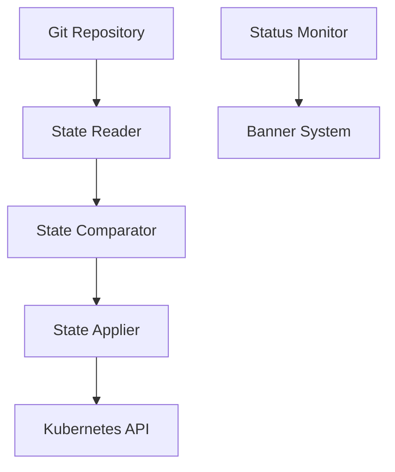
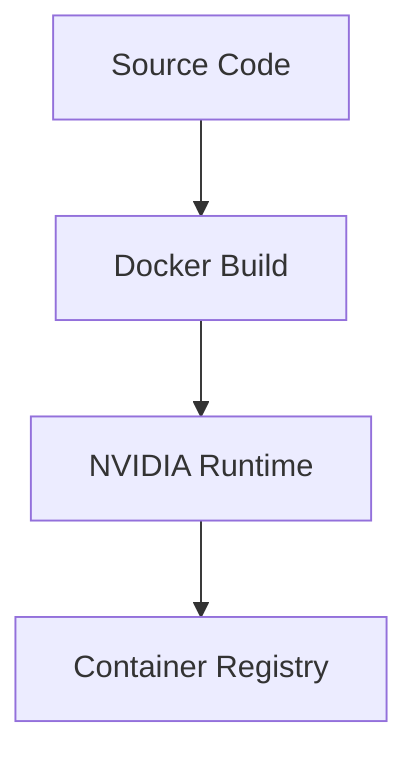

# Архитектура Zakenak

```ascii
 ______     _                      _    
|___  /    | |                    | |   
   / / __ _| |  _ _   ___     ___ | |  _
  / / / _` | |/ / _`||  _ \ / _` || |/ /
 / /_| (_| |  < by_Eberil| | (_| ||   < 
/_____\__,_|_|\_\__,||_| |_|\__,_||_|\_\

Should Harbour?	No.
```

## Обзор архитектуры

Zakenak представляет собой Go-бинарник, реализующий GitOps подход к управлению Kubernetes-кластером с поддержкой GPU-ускорения. Архитектура построена на принципах модульности, расширяемости и безопасности.

## Структура проекта

```bash
tools/zakenak/
├── cmd/                # Точки входа приложения
│   └── zakenak/       # Основной бинарник
├── pkg/               # Пакеты приложения
│   ├── banner/        # ASCII баннеры и UI элементы
│   ├── build/         # Сборка контейнеров
│   ├── config/        # Управление конфигурацией
│   ├── converge/      # Конвергенция состояния
│   ├── helm/          # Helm интеграция
│   └── state/         # Управление состоянием
└── docs/              # Документация
```

## Компоненты системы

### 1. Banner Package (pkg/banner)
Отвечает за визуальное представление статуса операций.

#### Основные функции:
```go
func PrintZakenak()  // Основной баннер приложения
func PrintError()    // Баннер ошибки
func PrintSuccess()  // Баннер успешного выполнения
func PrintDeploy()   // Баннер процесса деплоя
```

#### Особенности реализации:
- Потокобезопасность через sync.Mutex
- Контроль отображения через переменные окружения
- Единая точка конфигурации баннеров

### 2. Container Runtime

#### Docker интеграция:
```dockerfile
# Основные компоненты
FROM nvidia/cuda:12.8.0-base-ubuntu22.04
ENV NVIDIA_VISIBLE_DEVICES=all
ENV NVIDIA_DRIVER_CAPABILITIES=compute,utility
```

#### Особенности:
- Multi-stage сборка
- Оптимизация слоев
- Встроенная поддержка NVIDIA GPU
- Автоматическая инициализация Git

### 3. GitOps Controller

#### Основные операции:
- Инициализация репозитория
- Отслеживание изменений
- Применение конфигурации
- Валидация состояния

#### Пример конфигурации:
```yaml
version: "1.0"
project: zakenak
environment: prod

deploy:
  namespace: prod
  charts:
	- ./helm-charts/cert-manager
	- ./helm-charts/local-ca
```

### 4. State Management

#### Компоненты:
1. State Reader
   - Чтение текущего состояния кластера
   - Парсинг манифестов
   - Валидация ресурсов

2. State Comparator
   - Сравнение желаемого и текущего состояния
   - Определение необходимых изменений
   - Планирование обновлений

3. State Applier
   - Применение изменений
   - Откат при ошибках
   - Мониторинг прогресса

## Процессы и взаимодействия

### 1. Процесс конвергенции



### 2. Процесс сборки



## Безопасность

### 1. Container Security
- Непривилегированные контейнеры
- Минимальный базовый образ
- Сканирование уязвимостей
- Изоляция ресурсов

### 2. GPU Security
```yaml
securityContext:
  runAsNonRoot: true
  runAsUser: 1000
  capabilities:
	drop: ["ALL"]
```

## Конфигурация и настройка

### 1. Переменные окружения
| Переменная | Описание | По умолчанию |
|------------|-----------|--------------|
| `ZAKENAK_DEBUG` | Режим отладки | `false` |
| `ZAKENAK_DISABLE_BANNERS` | Отключение баннеров | `false` |
| `NVIDIA_VISIBLE_DEVICES` | Доступные GPU | `all` |

### 2. Конфигурация GPU
```yaml
build:
  gpu:
	enabled: true
	runtime: nvidia
	memory: "8Gi"
	devices: all
```

## Разработка и отладка

### 1. Development Container
```dockerfile
FROM golang:1.21-alpine AS builder
# Development tools
RUN go install github.com/cosmtrek/air@latest
RUN go install github.com/go-delve/delve/cmd/dlv@latest
```

### 2. Debug режим
- Remote debugging через dlv
- Hot reload с air
- Расширенное логирование

## API и интерфейсы

### 1. Command Line Interface
```bash
zakenak converge    # Конвергенция состояния
zakenak build       # Сборка контейнеров
zakenak deploy      # Деплой компонентов
zakenak status      # Проверка статуса
```

### 2. Программный интерфейс
```go
type Controller interface {
	Converge(ctx context.Context) error
	Build(ctx context.Context) error
	Deploy(ctx context.Context) error
	Status(ctx context.Context) (*Status, error)
}
```

## Мониторинг и метрики

### 1. Системные метрики
- Использование GPU
- Статус конвергенции
- Время выполнения операций
- Ошибки и предупреждения

### 2. Бизнес метрики
- Успешность деплоев
- Время восстановления
- Количество откатов
- Стабильность системы

## Требования к окружению

### Hardware
- NVIDIA GPU (Compute Capability 7.0+)
- 16GB RAM минимум
- NVMe SSD storage
- 10Gbps сеть (рекомендуется)

### Software
- Go 1.21+
- Docker с NVIDIA Runtime
- Kubernetes 1.25+
- CUDA 12.8+

## Лицензирование

```plain text
Copyright (c) 2025 Mikhail Eberil

This file is part of Zakenak project and is released under the terms of the MIT License. 
See LICENSE file in the project root for full license information.

THE SOFTWARE IS PROVIDED "AS IS", WITHOUT WARRANTY OF ANY KIND, EXPRESS OR IMPLIED, 
INCLUDING BUT NOT LIMITED TO THE WARRANTIES OF MERCHANTABILITY, FITNESS FOR A PARTICULAR 
PURPOSE AND NONINFRINGEMENT.
```