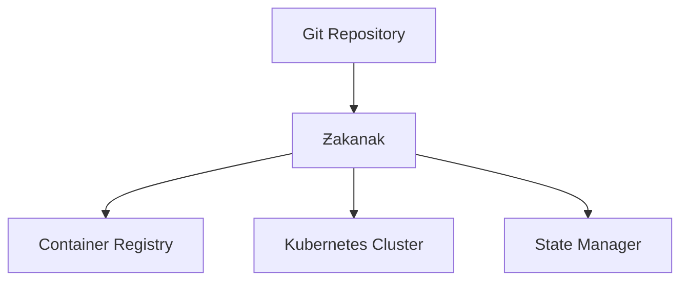

```ascii
	 ______     _                        _    
	|___  /    | |                      | |   
	   / / __ _| | ____ _ _ __   __ _  | | __
	  / / / _` | |/ / _` | '_ \ / _` | | |/ /
	 / /_| (_| |   < (_| | | | | (_| | |   < 
	/_____\__,_|_|\_\__,_|_| |_|\__,_| |_|\_\
								by @eberil

	"Because harbors should be safe and deployments smooth"
```

# Ƶakanak

[](https://goreportcard.com/report/github.com/i8meg/zakanak)
[](LICENSE)
[](https://github.com/i8meg/zakanak/releases)

Ƶakanak (чаканак) - элегантный инструмент для GitOps и деплоя, вдохновленный werf но переосмысленный для максимальной эффективности и простоты использования.

## Особенности
- 🚀 **Единый бинарный файл** без внешних зависимостей
- 🔄 **Встроенная поддержка GitOps** и конвергенции
- 🐳 **Интеграция с container registry**
- 🖥️ **Нативная поддержка WSL2** и NVIDIA GPU
- 📝 **Упрощенная но мощная** система шаблонизации

## Быстрый старт

### Установка
```bash
# Сборка из исходников
git clone https://github.com/i8meg/zakanak
cd zakanak
go build -o zakanak

# Установка бинарного файла
sudo mv zakanak /usr/local/bin/
```

### Базовая конфигурация
```yaml
project: myapp
environment: prod

deploy:
  namespace: prod
  charts:
	- ./helm/myapp
```

### Основные команды
```bash
# Конвергенция состояния
zakanak converge

# Сборка образов
zakanak build

# Деплой в кластер
zakanak deploy
```

## Документация
- [Руководство по установке](docs/installation.md)
- [Конфигурация](docs/configuration.md)
- [Примеры использования](docs/examples.md)
- [FAQ](docs/faq.md)
- [Cookbook](docs/COOKBOOK.md)

## Требования
- Go 1.21+
- Kubernetes 1.19+
- Docker
- WSL2 (для Windows)
- NVIDIA GPU + драйверы (опционально)

## Сравнение с аналогами
| Функция | Ƶakanak | werf | Другие |
|---------|---------|------|---------|
| Единый бинарник | ✅ | ❌ | ❌ |
| GPU поддержка | ✅ | ❌ | ❌ |
| GitOps | ✅ | ✅ | ⚠️ |
| Простота | ✅ | ⚠️ | ⚠️ |

## Архитектура


## Вклад в проект
1. Fork репозитория
2. Создайте feature branch
3. Commit изменений
4. Push в ваш fork
5. Создайте Pull Request

## Лицензия
MIT

## Авторы
- [@eberil](https://github.com/eberil) - Основной разработчик

## Благодарности
- Команде Werf за вдохновение
- Сообществу Kubernetes
- Всем контрибьюторам