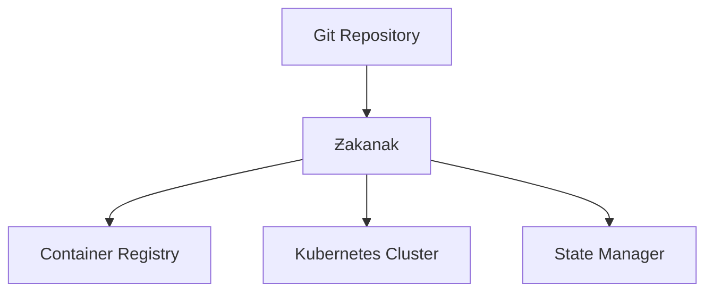

```ascii
	 ______     _                      _    
	|___  /    | |                    | |   
	   / / __ _| |  _ _   ___     ___ | |  _
	  / / / _` | |/ / _`||  _ \ / _` || |/ /
	 / /_| (_| |   |by_Ӗberil|   (_| ||   < 
	/_____\__,_|_|\_\__,||_| |_|\__,_||_|\_\
  
					  	Should Harbour?				
```

# [ƵakӖnak™®](https://dic.academic.ru/dic.nsf/dic_synonims/390396/%D1%87%D0%B0%D0%BA%D0%B0%D0%BD%D0%B0%D0%BAчаканак "др.-чув. чӑканӑк — бухта, залив")
[](https://goreportcard.com/report/github.com/i8meg/zakenak)
[](LICENSE)
[][def]
|Cвежий взгляд||Через ширинку |
|:-:|:-:|:-:|
|[Werf](https://github.com/werf)|на|[WSL2](https://learn.microsoft.com/ru-ru/windows/wsl/install)|
#
#### `ƵakӖnak™®®™` — карманный инструмент для ежедневной `Helm`-оркестрации однонодового `Kind` кластера `Kubernetes`.
>- 💩 [Wsl-Ubuntu-22.03](https://learn.microsoft.com/ru-ru/windows/wsl/tutorials/wsl-containers).
>- ☠️ Easy Kind Cluster Setup Tools
>- 🤖 LLM-models 
>- 👀 Helm Charts: 
>	- cert-manager
>	- local-ca
>	- sidecar-injector
>	- open-webui
>	- ollama

## Особенности
- 🚀 **Единый бинарный файл** без внешних зависимостейа
- 🔄 **Встроенная поддержка GitOps** и конвергенции
- 🐳 **Интеграция с container registry**
- 🖥️ **Нативная поддержка WSL2** и NVIDIA GPU 🤢
- 📝 **Упрощенная но мощная** система шаблонизации

## Быстрый старт

### Установка
```bash
# Сборка из исходников
git clone https://github.com/i8meg/zakenak
cd zakenak
go build -o zakenak

# Установка бинарного файла
sudo mv zakenak /usr/local/bin/
```

### Базовая конфигурация
```yaml
project: myapp
environment: prod

deploy:
  namespace: prod
  charts:
	- ./helm/myapp
```

### Основные команды
```bash
# Конвергенция состояния
zakenak converge

# Сборка образов
zakenak build

# Деплой в кластер
zakenak deploy
```

## Документация
- [Руководство по установке](docs/installation.md)
- [Конфигурация](docs/configuration.md)
- [Примеры использования](docs/examples.md)
- [FAQ](docs/faq.md)
- [Cookbook](docs/COOKBOOK.md)

## Требования
- Go 1.21+
- Kubernetes 1.19+
- Docker
- WSL2 (для Windows)
- NVIDIA GPU + драйверы (опционально)

## Сравнение с аналогами
| Функция | ƵakӖnak™® | werf | Другие |
|---------|---------|------|---------|
| Единый бинарник | ✅ | ❌ | ❌ |
| GPU поддержка | ✅ | ❌ | ❌ |
| GitOps | ✅ | ✅ | ⚠️ |
| Простота | ✅ | ⚠️ | ⚠️ |

## Архитектура


## Вклад в проект
1. Fork репозитория
2. Создайте feature branch
3. Commit изменений
4. Push в ваш fork
5. Создайте Pull Request

## Лицензия
[](LICENSE)

## Авторы
- [@ӗberil](https://github.com/eberil) - Основной разработчик

## Благодарности
- Команде Werf за вдохновение
- Сообществу Kubernetes
- Всем контрибьюторам

[def]: https://github.com/i8meg/zakenak/releases